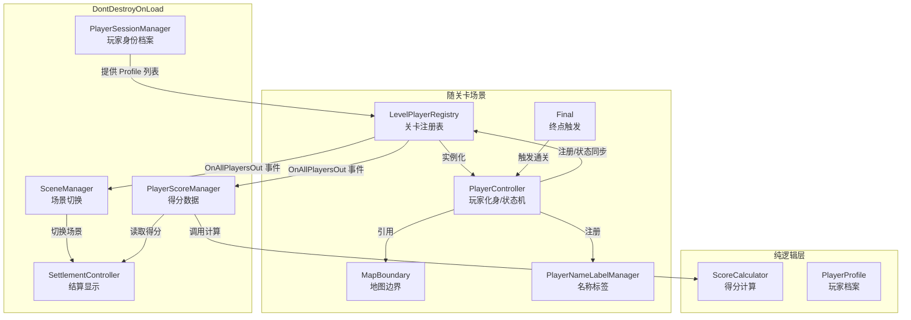
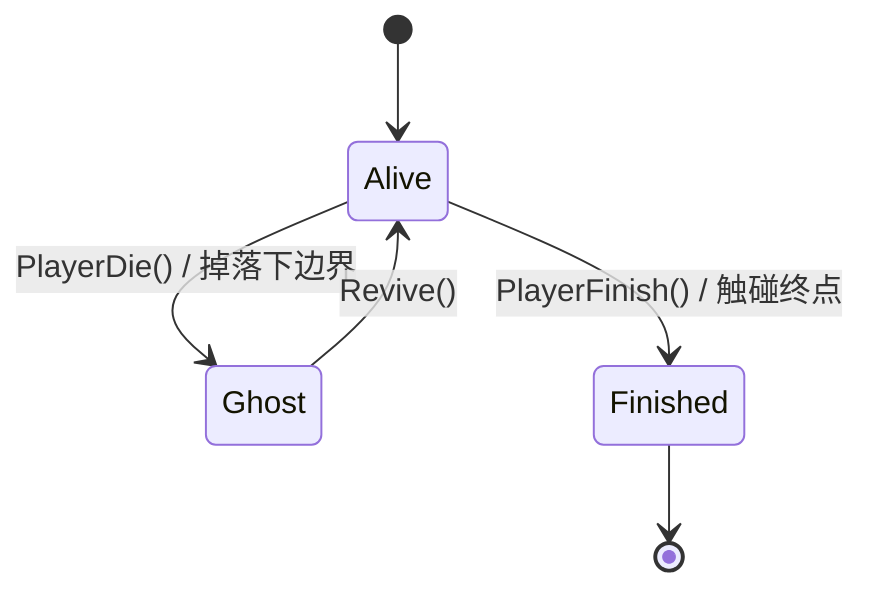
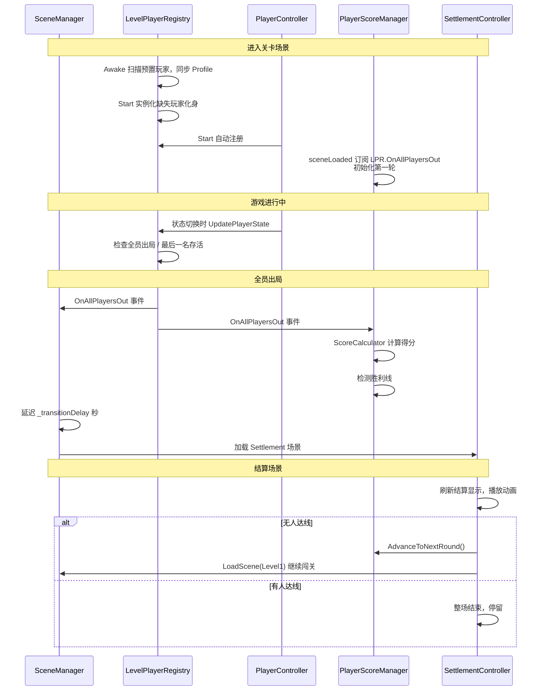

# SuperQQ 脚本代码说明文档

> 本文档面向同小组开发同学，用于同步项目进度、了解公开接口、协同开发。
> 重点说明 Player 管理、SceneManager、PopupManager 等高频使用与公开 API 的模块；Settlement 等低耦合模块仅作简要说明。
> 代码路径：`Assets/Scripts/`，共 26 个 C# 脚本，按功能划分到 6 个命名空间。

---

## 一、整体架构

项目采用**分层 + 单例**架构，核心设计原则是"身份与化身分离"：玩家的持久身份（`PlayerProfile`）与场景内的化身（`PlayerController`）解耦，避免跨场景引用失效。

### 1.1 三层划分

| 层级 | 职责 | 生命周期 | 代表类 |
|------|------|----------|--------|
| **持久层** | 跨场景保留的全局状态 | `DontDestroyOnLoad` | `PlayerSessionManager`、`PlayerScoreManager`、`SceneManager`、`SettlementController` |
| **场景层** | 随关卡场景创建与销毁 | 场景加载/卸载 | `LevelPlayerRegistry`、`PlayerController`、`PlayerNameLabelManager`、`MapBoundary`、`Final` |
| **纯逻辑层** | 不依赖 Unity 的可测试逻辑 | 无 | `ScoreCalculator`、`PlayerProfile`、`RoundScoreData` 等 |

### 1.2 命名空间与目录映射

| 命名空间 | 目录 | 包含类 |
|----------|------|--------|
| `SuperQQ.Player` | `Player/` | `PlayerController`、`PlayerSessionManager`、`LevelPlayerRegistry`、`PlayerProfile`、`PlayerStateType`、`IPlayerState`、`PlayerAliveState`、`PlayerGhostState`、`PlayerFinishedState`、`MapBoundary` |
| `SuperQQ.Scene` | `Scene/` | `SceneManager` |
| `SuperQQ.Score` | `Score/` | `PlayerScoreManager`、`ScoreCalculator`、`PlayerScoreRecord`、`RoundScoreData`、`RoundScoreInput`、`ScoreType` |
| `SuperQQ.Settlement` | `Settlement/` | `SettlementController`、`PlayerTrack`、`ScorePillar`、`ScorePillarConfig`、`VictoryLine` |
| `SuperQQ.UI` | `UI/` | `PopupManager`、`PopupController`、`PlayerNameLabel`、`PlayerNameLabelManager` |
| `SuperQQ.Map` | `Map/` | `Final` |

### 1.3 架构关系图



### 1.4 单例与持久化速查

| 类名 | 单例访问 | 是否持久化 | 挂载位置 |
|------|----------|------------|----------|
| `PlayerSessionManager` | `Instance` | 是 | 持久化 GameObject（如 GameManager） |
| `PlayerScoreManager` | `Instance` | 是 | 持久化 GameObject |
| `SceneManager` | `Instance` | 是 | 持久化 GameObject |
| `SettlementController` | `Instance` | 是 | Settlement 场景（首次加载后持久化） |
| `LevelPlayerRegistry` | `Instance` | 否 | 每个关卡场景 |
| `PopupManager` | `Instance` | 否 | UI Canvas 下 |
| `PlayerNameLabelManager` | `Instance` | 否 | 主 Canvas 下 |

> 所有单例均使用 `FindFirstObjectByType` 懒查找作为兜底，访问 `Instance` 前无需手动赋值。

---

## 二、Player 模块（重点）

Player 模块是项目核心，采用状态机模式管理玩家行为，并通过"身份/化身分离"解决跨场景引用问题。

### 2.1 PlayerSessionManager — 玩家身份持久化中心

**命名空间**：`SuperQQ.Player`　**持久化**：是

只持有纯数据 `PlayerProfile`，不持有任何 `MonoBehaviour` 引用。在准备阶段由组队 UI 调用 `RegisterProfile` 注册玩家档案；关卡场景加载时由 `LevelPlayerRegistry` 读取 Profile 列表实例化玩家化身。

#### 公开事件

| 事件 | 签名 | 触发时机 | 订阅方 |
|------|------|----------|--------|
| `OnProfileRegistered` | `Action<PlayerProfile>` | 新玩家档案注册成功 | `PlayerScoreManager`（为新玩家初始化得分记录） |

#### 公开 API

| 成员 | 签名 | 说明 |
|------|------|------|
| `Instance` | `static PlayerSessionManager` | 全局唯一实例 |
| `Profiles` | `IReadOnlyList<PlayerProfile>` | 所有已注册档案（按注册顺序，只读） |
| `PlayerCount` | `int` | 已注册玩家数量 |
| `RegisterProfile` | `void RegisterProfile(PlayerProfile profile)` | 注册档案，重名跳过，成功后触发 `OnProfileRegistered` |
| `UnregisterProfile` | `void UnregisterProfile(string playerName)` | 移除指定名称档案 |
| `ClearAllProfiles` | `void ClearAllProfiles()` | 清空所有档案（返回主菜单时调用） |
| `HasPlayer` | `bool HasPlayer(string playerName)` | 判断是否已注册 |
| `GetProfile` | `PlayerProfile GetProfile(string playerName)` | 获取档案，未找到返回 `null` |
| `GetOrderedPlayerNames` | `List<string> GetOrderedPlayerNames()` | 按注册顺序的名称列表，**结算轨道固定展示顺序以此为准** |

#### 使用示例

```csharp
// 准备阶段注册玩家
var profile = new PlayerProfile
{
    PlayerName = "Player1",
    PlayerColor = Color.red,
    LeftKey = KeyCode.A,
    RightKey = KeyCode.D,
    JumpKey = KeyCode.Space,
    JumpKeyAlt = KeyCode.W,
    DownKey = KeyCode.S
};
PlayerSessionManager.Instance.RegisterProfile(profile);

// 查询某玩家档案
PlayerProfile profile = PlayerSessionManager.Instance.GetProfile("Player1");
```

> 注册顺序即结算展示顺序（Player1 → Player2 → Player3 从左到右），新增玩家时注意注册顺序。

### 2.2 LevelPlayerRegistry — 关卡玩家注册表

**命名空间**：`SuperQQ.Player`　**持久化**：否（场景级）

场景内单例，管理本关卡中的 `PlayerController` 实例。进入关卡时根据 `PlayerSessionManager` 的 Profile 列表实例化玩家化身；退出关卡时随场景销毁，不持有跨场景引用。

#### 生命周期要点

- **Awake**：扫描场景中预置的 `PlayerController`，按 `PlayerName` 排序后注册，并同步身份到 `PlayerSessionManager`。必须在 Awake 完成，因为 `PlayerScoreManager` 的 `sceneLoaded` 回调在 `Start` 之前触发，依赖 Profile 已填充。
- **Start**：根据 `PlayerSessionManager` 的 Profile 列表，为缺少化身的档案实例化玩家（跳过已存在的同名玩家）。
- **OnDestroy**：清空单例引用，随场景销毁。

#### 公开事件

| 事件 | 签名 | 触发时机 | 订阅方 |
|------|------|----------|--------|
| `OnAllPlayersOut` | `Action` | 所有玩家都已出局（无存活玩家且玩家数 > 0） | `SceneManager`（切换结算场景）、`PlayerScoreManager`（计算得分） |

#### 公开 API

| 成员 | 签名 | 说明 |
|------|------|------|
| `Instance` | `static LevelPlayerRegistry` | 当前场景全局唯一实例 |
| `Players` | `IReadOnlyList<PlayerController>` | 本关所有玩家（按注册顺序，只读） |
| `PlayerCount` | `int` | 本关玩家数量 |
| `BIsLastPlayerStanding` | `bool` | 是否只剩一名存活玩家 |
| `EarlyQuitHoldDuration` | `float` | 提前放弃长按时长（1.6 秒） |
| `RegisterPlayer` | `void RegisterPlayer(PlayerController player)` | 注册玩家（由 `PlayerController.Start` 自动调用） |
| `UnregisterPlayer` | `void UnregisterPlayer(PlayerController player)` | 注销玩家（由 `PlayerController.OnDestroy` 自动调用） |
| `UpdatePlayerState` | `void UpdatePlayerState(PlayerController player, PlayerStateType stateType)` | 更新玩家状态记录（由 `PlayerController` 状态切换时调用） |
| `GetPlayersByState` | `List<PlayerController> GetPlayersByState(PlayerStateType stateType)` | 按状态筛选玩家（结算时获取通关顺序） |
| `FindPlayerByName` | `PlayerController FindPlayerByName(string playerName)` | 按名称查找玩家 |
| `GetLastAlivePlayer` | `PlayerController GetLastAlivePlayer()` | 获取唯一存活玩家，多人或无人存活返回 `null` |
| `TriggerEarlyQuit` | `void TriggerEarlyQuit(PlayerController player)` | 触发提前放弃，该玩家立即死亡 |
| `GetPlayerColor` | `Color GetPlayerColor(string playerName)` | 获取玩家颜色，化身销毁后回退到 Profile |

#### 提前结束机制

当场上玩家数 ≥ 2 且只剩 1 名存活玩家时，`CheckLastPlayerStanding` 通过 `PopupManager.ShowPopup` 弹出 `EndEarlyPopup`（3 秒自动关闭）。最后一名存活玩家长按 `DownKey` 1.6 秒触发 `TriggerEarlyQuit`，该玩家死亡后由 `CheckAllPlayersOut` 检测到全员出局并触发结算。

#### Inspector 配置字段

| 字段 | 类型 | 说明 |
|------|------|------|
| `_playerPrefab` | `PlayerController` | 玩家预制体，为空则创建空 GameObject 挂载组件 |
| `_spawnPoints` | `Transform[]` | 出生点列表，按索引对应玩家序号 |
| `_endEarlyPopupPrefab` | `GameObject` | 提前结束弹窗 Prefab |

#### 使用示例

```csharp
// 获取本关所有通关玩家（按通关顺序）
List<PlayerController> finishedPlayers =
    LevelPlayerRegistry.Instance.GetPlayersByState(PlayerStateType.Finished);

// 订阅全员出局事件（通常由 SceneManager/PlayerScoreManager 内部完成）
LevelPlayerRegistry.Instance.OnAllPlayersOut += HandleAllPlayersOut;
```

### 2.3 PlayerController — 玩家状态机持有者

**命名空间**：`SuperQQ.Player`　**持久化**：否

`[RequireComponent(typeof(Rigidbody2D))]`，管理组件引用、输入读取和状态切换。存活/幽灵/通关的具体行为委托给 `IPlayerState` 实现。

#### 状态切换 API

| 方法 | 说明 |
|------|------|
| `PlayerDie()` | 死亡，进入幽灵状态（已死亡则跳过） |
| `Revive()` | 复活，回到存活状态并重置到出生点 |
| `PlayerFinish()` | 通关，进入通关状态（已通关或已死亡则跳过） |
| `TransitionTo(IPlayerState)` | 通用状态切换：先 Exit 旧状态再 Enter 新状态，并通知 `LevelPlayerRegistry` |

#### 档案 API

| 方法 | 说明 |
|------|------|
| `ApplyProfile(PlayerProfile)` | 应用档案配置（名称、颜色、键位），由 `LevelPlayerRegistry` 实例化后调用 |
| `BuildProfile()` | 根据当前配置构建档案，用于将场景预置玩家同步到 `PlayerSessionManager` |

#### 状态查询

| 属性 | 类型 | 说明 |
|------|------|------|
| `BIsGrounded` | `bool` | 是否在地面 |
| `BIsJumping` | `bool` | 是否正在跳跃 |
| `BIsDead` | `bool` | 是否为幽灵状态 |
| `BIsFinished` | `bool` | 是否已通关 |
| `HorizontalVelocity` | `float` | 当前水平速度 |
| `PlayerName` | `string` | 玩家名称 |
| `PlayerColor` | `Color` | 玩家颜色 |
| `DownKey` | `KeyCode` | 下蹲/幽灵下移键 |

#### 自动注册流程

`Start` 时自动注册到 `LevelPlayerRegistry` 和 `PlayerNameLabelManager`；`OnDestroy` 时自动注销。无需手动调用注册接口。

#### 调试按键

| 按键 | 功能 |
|------|------|
| `K` | 立即死亡（进入幽灵状态） |
| `R` | 复活（回到存活状态） |

#### 主要 Inspector 参数

移动（`moveSpeed`/`acceleration`/`deceleration`/`airControlMultiplier`）、重力（`gravityScale`）、跳跃（`jumpVelocity`/`jumpHoldAccel`/`maxJumpHoldTime`/`jumpCutMultiplier`/`coyoteTime`）、下落手感（`fallMultiplier`/`lowJumpMultiplier`/`maxFallSpeed`）、地面检测（`groundCheck`/`groundCheckRadius`/`groundLayer`）、外部引用（`mapBoundary`）、幽灵设置（`ghostMoveSpeed`/`ghostAlpha`/`ghostSpawnPosition`）、键位（`leftKey`/`rightKey`/`jumpKey`/`jumpKeyAlt`/`downKey`）。

> `mapBoundary` 若未在 Inspector 手动配置，`MapBoundary` 属性会通过 `FindAnyObjectByType<MapBoundary>()` 懒查找兜底，确保预制体实例也能正确约束边界。

### 2.4 PlayerProfile / PlayerStateType

**PlayerProfile**（`SuperQQ.Player`）：跨场景持久化的纯数据结构，`[System.Serializable]`，包含 `PlayerName`、`PlayerColor`、`LeftKey`、`RightKey`、`JumpKey`、`JumpKeyAlt`、`DownKey`。不持有任何 MonoBehaviour 引用。

**PlayerStateType**（`SuperQQ.Player`）：玩家状态枚举，与状态实现类一一对应。

| 枚举值 | 对应状态类 | 说明 |
|--------|------------|------|
| `Alive` | `PlayerAliveState` | 存活：可移动、跳跃、被攻击 |
| `Ghost` | `PlayerGhostState` | 幽灵：四向飞行、无碰撞 |
| `Finished` | `PlayerFinishedState` | 通关：到达终点、停止行为 |

### 2.5 状态机：IPlayerState 与三个实现

**IPlayerState**（`SuperQQ.Player`）：状态接口，定义 `Enter()`/`Exit()`/`Update()`/`FixedUpdate()` 生命周期及 `BIsGrounded`/`BIsJumping`/`HorizontalVelocity` 查询。每个状态拥有独立的运行时数据，构造时传入 `PlayerController` 上下文。



#### PlayerAliveState

存活状态：左右移动（平滑插值）、可变高度跳跃（长按追加向上速度）、下落手感优化（下落加重力、松手短跳）、土狼时间（coyote time）。边界约束：左右夹紧、掉落下边界死亡。包含提前放弃长按检测（仅最后一名存活玩家生效）。

#### PlayerGhostState

幽灵状态：四向平移、无重力、半透明、无碰撞。`Enter` 时禁用 Collider、取消重力、传送至 `GhostSpawnPosition`、设置半透明；`Exit` 时恢复。边界约束：四边夹紧（`ClampAll`）。

> Collider 可能为 null（未配置预制体时），状态类对 Collider 操作均做 null 检查，避免 NullReferenceException 阻断后续操作。

#### PlayerFinishedState

通关状态：禁用 Collider、取消重力、角色消失（隐藏 Renderer）、停止速度。`Exit` 时恢复全部。无 Update/FixedUpdate 逻辑。

### 2.6 MapBoundary — 地图边界

**命名空间**：`SuperQQ.Player`　**持久化**：否

定义可活动区域的矩形范围（`mapMinX`/`mapMaxX`/`mapMinY`/`mapMaxY`），由 `PlayerController` 引用。

| 方法 | 说明 |
|------|------|
| `ClampHorizontal(Vector2)` | 夹紧到左右边界内 |
| `ClampAll(Vector2)` | 夹紧到四周边界内（幽灵用） |
| `IsBelowBoundary(float y)` | 判断是否超出下边界（掉落死亡线） |

`OnDrawGizmosSelected` 在 Scene 视图绘制边界矩形。存活状态不约束上边界（可跳跃超出地图上方），不约束下边界（用死亡判定代替）；幽灵状态四边均约束。

---

## 三、Scene 模块

### 3.1 SceneManager — 场景切换

**命名空间**：`SuperQQ.Scene`　**持久化**：是

负责场景切换逻辑，监听 `LevelPlayerRegistry.OnAllPlayersOut` 事件，自动延迟切换到结算场景。也可通过 `LoadScene` 主动切换任意场景。挂载到跨场景不销毁的 GameObject（如 GameManager）。

#### 公开 API

| 成员 | 签名 | 说明 |
|------|------|------|
| `Instance` | `static SceneManager` | 全局唯一实例 |
| `BIsTransitioning` | `bool` | 是否正在切换场景中（防止重复触发） |
| `CurrentSceneName` | `string` | 当前激活场景名称 |
| `LoadScene` | `void LoadScene(string sceneName)` | 加载指定场景，切换中则跳过 |
| `ReloadCurrentScene` | `void ReloadCurrentScene()` | 重新加载当前场景 |

#### Inspector 配置

| 字段 | 说明 |
|------|------|
| `_settlementSceneName` | 单关卡结算场景名称（全员出局后切换目标） |
| `_transitionDelay` | 所有玩家出局后延迟切换秒数（默认 2 秒） |

#### 工作机制

- `OnEnable` 订阅 `sceneLoaded` 事件，每次场景加载完成时重新订阅新场景的 `LevelPlayerRegistry.OnAllPlayersOut`。
- 全员出局时调用 `HandleSettlement`，延迟 `_transitionDelay` 秒后异步加载结算场景。
- `LoadScene` 内部使用协程异步加载，加载前取消旧订阅，加载后订阅新场景 Registry。

#### 使用示例

```csharp
// 主动切换到指定场景
SceneManager.Instance.LoadScene("Level2");

// 重新加载当前关卡
SceneManager.Instance.LoadScene("Level1");

// 查询当前是否在切换中
if (!SceneManager.Instance.BIsTransitioning)
{
    SceneManager.Instance.LoadScene("Settlement");
}
```

> **命名空间冲突注意**：项目自定义了 `SuperQQ.Scene.SceneManager`，与 Unity 的 `UnityEngine.SceneManagement.SceneManager` 同名。在 `SettlementController` 等同时使用两者的文件中，已通过 `using UnityEngine.SceneManagement;` 引入 Unity 版本，并通过 `Scene.SceneManager`（命名空间限定）访问项目版本。新增脚本若同时引用两者，需注意用命名空间前缀区分，避免歧义。

---

## 四、UI 模块

### 4.1 PopupManager — 弹窗管理

**命名空间**：`SuperQQ.UI`　**持久化**：否

全局管理弹窗的弹出、关闭和对象池复用。挂载到 UI Canvas 下的 GameObject。对外暴露 `ShowPopup` 接口，游戏逻辑随时可快捷弹出弹窗。所有弹窗 Prefab 应在根节点挂载 `PopupController`（未挂载时 `ShowPopup` 会自动添加）。

#### 公开 API

| 成员 | 签名 | 说明 |
|------|------|------|
| `Instance` | `static PopupManager` | 全局唯一实例 |
| `ActivePopupCount` | `int` | 当前活跃弹窗数量 |
| `ShowPopup` | `PopupController ShowPopup(GameObject popupPrefab, float autoCloseDuration = 0f)` | **简写重载**：默认容器、无回调，`autoCloseDuration` 为 0 表示不自动关闭 |
| `ShowPopup` | `PopupController ShowPopup(GameObject popupPrefab, float autoCloseDuration, Action<PopupController> onCloseCallback, Transform parent, bool bSortAsTopMost)` | **完整重载**：可指定关闭回调、父级、是否置顶 |
| `ClosePopup` | `void ClosePopup(PopupController controller)` | 手动关闭指定弹窗 |
| `CloseAllPopups` | `void CloseAllPopups()` | 关闭所有活跃弹窗 |

#### ShowPopup 参数说明

| 参数 | 类型 | 说明 |
|------|------|------|
| `popupPrefab` | `GameObject` | 弹窗 Prefab |
| `autoCloseDuration` | `float` | 自动关闭时长（秒），0 表示不自动关闭 |
| `onCloseCallback` | `Action<PopupController>` | 关闭回调，参数为被关闭的控制器，可传 `null` |
| `parent` | `Transform` | 父级 Transform，为 `null` 时用默认容器 `_popupContainer` |
| `bSortAsTopMost` | `bool` | 是否置于所有弹窗最上层 |

返回值为 `PopupController` 引用，可用于手动关闭或查询剩余时间。

#### 使用示例

```csharp
// 最常用：弹出自动关闭的提示弹窗（3 秒后关闭）
PopupManager.Instance.ShowPopup(myPopupPrefab, 3f);

// 不自动关闭，需手动关闭
PopupController ctrl = PopupManager.Instance.ShowPopup(myPopupPrefab, 0f);
// ...稍后手动关闭
PopupManager.Instance.ClosePopup(ctrl);

// 带关闭回调的完整调用
PopupManager.Instance.ShowPopup(
    confirmPopupPrefab,
    0f,
    onCloseCallback: (controller) => { Debug.Log("弹窗已关闭"); },
    parent: null,
    bSortAsTopMost: true);
```

#### 对象池机制

- 按 Prefab 索引维护对象池，关闭的弹窗 `SetActive(false)` 后入池复用，避免反复实例化。
- Prefab 通过名称注册到 `_prefabRegistry`，回收时按实例名称反查 Prefab 键。未注册的实例直接销毁。
- `PopupManager` 未指定 `_popupContainer` 时使用自身 Transform 作为容器。

### 4.2 PopupController — 弹窗控制器

**命名空间**：`SuperQQ.UI`

挂载到弹窗 Prefab 根节点，负责自动关闭倒计时、关闭回调和生命周期。由 `PopupManager` 创建时自动初始化，通常无需手动调用。

| 成员 | 说明 |
|------|------|
| `RemainingTime` | 剩余自动关闭时间，不自动关闭时返回 -1 |
| `BIsInitialized` | 是否已初始化 |
| `Initialize(float, Action<PopupController>)` | 初始化，由 `PopupManager` 调用 |
| `Close()` | 关闭弹窗：触发回调、重置状态、禁用对象 |
| `ResetState()` | 重置状态，对象池复用前调用 |

> 制作弹窗 Prefab 时，根节点需为 `RectTransform`，锚点设为 `(0.5, 0.5)` 居中、Scale 为 1、位置归零，否则在 Canvas 中可能渲染到屏幕外。

### 4.3 PlayerNameLabel / PlayerNameLabelManager — 玩家名称标签

**命名空间**：`SuperQQ.UI`　**持久化**：否

`PlayerNameLabelManager` 是场景级单例，挂载到主 Canvas（Screen Space Overlay）下，统一创建和管理所有玩家名称标签。2-4 人共用一个 Canvas，所有 `TextMeshProUGUI` 合批为 1 Draw Call。`PlayerController.Start/OnDestroy` 会自动调用 `RegisterPlayer/UnregisterPlayer`，无需手动管理。

`PlayerNameLabel`（`[RequireComponent(typeof(TextMeshProUGUI))]`）在 `LateUpdate` 中将玩家头顶世界坐标转为屏幕坐标更新标签位置，并根据存活/幽灵状态切换名称颜色。

| 字段 | 说明 |
|------|------|
| `_fontSize` | 名称字号 |
| `_labelSize` | 标签尺寸 |
| `_outlineWidth` / `_outlineColor` | 描边宽度和颜色 |

---

## 五、Score 模块

### 5.1 PlayerScoreManager — 得分数据中心

**命名空间**：`SuperQQ.Score`　**持久化**：是

跨场景持久化的得分数据中心。监听 `LevelPlayerRegistry.OnAllPlayersOut` 触发 `ScoreCalculator` 计算得分，暴露查询接口供结算页、HUD 读取。**陷阱系统和老板事件系统通过本类的记录接口提交数据**。

#### 公开常量

| 常量 | 值 | 说明 |
|------|----|------|
| `VICTORY_LINE` | `100` | 胜利线分数 |

#### 公开事件

| 事件 | 签名 | 触发时机 |
|------|------|----------|
| `OnRoundScored` | `Action<Dictionary<string, RoundScoreData>>` | 轮次结算完成，参数为本轮所有玩家得分明细 |
| `OnGameFinished` | `Action<List<string>>` | 至少一人达到胜利线，参数为已排序的最终排名名称列表 |

#### 供其他系统调用的记录 API

| 方法 | 说明 | 调用方 |
|------|------|--------|
| `RecordTrapKill(string ownerPlayerName)` | 记录一次陷阱有效击杀，同一玩家可多次调用 | 陷阱系统 |
| `RecordBossQuiet(string playerName)` | 记录老板巡视安静达标 | 老板事件系统 |
| `AdvanceToNextRound()` | 进入下一轮：递增轮次索引、清空本轮中间数据 | `SettlementController`（确认继续时调用） |

#### 查询 API

| 方法 | 说明 |
|------|------|
| `GetPlayerScoreRecord(string)` | 获取玩家得分记录，未找到返回 `null` |
| `GetPlayerTotalScore(string)` | 获取累计总分 |
| `GetPlayerRoundScore(string, int roundIndex)` | 获取指定轮次得分明细 |
| `GetRankedPlayerNames()` | 获取累计总分降序排名（总分→通关次数→陷阱命中次数） |
| `BHasPlayerReachedVictoryLine()` | 是否有人达到胜利线 |

#### 公开查询属性

| 属性 | 说明 |
|------|------|
| `CurrentRoundIndex` | 当前轮次索引（从 1 开始，0 表示尚未开始） |
| `BIsRoundScored` | 是否已完成本轮结算 |

#### 使用示例

```csharp
// 陷阱系统：记录一次有效击杀
PlayerScoreManager.Instance.RecordTrapKill("Player1");

// 查询玩家累计总分
int totalScore = PlayerScoreManager.Instance.GetPlayerTotalScore("Player1");

// 判断是否有人达线（结算流程控制用）
bool hasWinner = PlayerScoreManager.Instance.BHasPlayerReachedVictoryLine();
```

> 首次进入关卡时由 `InitializeFirstRound` 根据 `PlayerSessionManager` 的档案列表注册所有玩家得分记录，并订阅 `OnProfileRegistered` 被动注册后续新玩家。

### 5.2 ScoreCalculator + 数据结构

**ScoreCalculator**（`SuperQQ.Score`）：纯逻辑静态类，不依赖 Unity，可独立单元测试。接收 `RoundScoreInput` 和此前累计分，输出每个玩家的 `RoundScoreData`。

得分规则（有人通关时生效，无人通关则五项全为 0）：

| 得分类型 | 分值 | 条件 |
|----------|------|------|
| `Completion` | +20 | 通关 |
| `FirstPlace` | +10 | 第一个通关者 |
| `SoloClear` | +15 | 仅一人通关且该玩家通关 |
| `TrapKill` | +5/次 | 陷阱有效击杀，最多计 2 次 |
| `SpecialEffect` | +10 | 老板巡视安静达标 |

核心入口：`ScoreCalculator.Calculate(int roundIndex, List<string> allPlayerNames, RoundScoreInput input, Dictionary<string,int> previousCumulativeScores)`。

**数据结构**（均为纯数据，不依赖 Unity）：

| 类 | 说明 |
|----|------|
| `ScoreType` | 得分类型枚举（Completion/FirstPlace/SoloClear/TrapKill/SpecialEffect） |
| `RoundScoreInput` | 单轮结算输入：通关玩家列表、陷阱击杀次数、安静达标玩家 |
| `RoundScoreData` | 单轮得分明细：轮次索引、五项得分字典、本轮合计、累计总分 |
| `PlayerScoreRecord` | 单玩家累计记录：总分、每轮明细历史、通关次数、陷阱击杀次数 |

---

## 六、Settlement 模块（简要）

结算模块负责结算场景的视觉呈现与流程控制，与其他模块耦合度较低。主要通过读取 `PlayerScoreManager` 的数据驱动显示，动画完成后根据胜利线检测结果决定回到关卡或整场结束。

### 6.1 SettlementController

**命名空间**：`SuperQQ.Settlement`　**持久化**：是

持久化单例，监听 `sceneLoaded`，进入 Settlement 场景时刷新结算显示，退出时隐藏轨道根节点保留对象。结算动画完成后：无人达线 → 延迟 `_settlementEndDelay` 秒后调用 `PlayerScoreManager.AdvanceToNextRound()` 并加载 `_levelSceneName` 继续闯关；有人达线 → 显示"整场结束"调试文本并停留。

- 玩家轨道按 `PlayerSessionManager.GetOrderedPlayerNames()` 注册顺序从左到右排列。
- 轨道与柱体宽度由 `ScorePillarConfig` 根据玩家数量和相机宽度动态计算。
- 得分为 0 的柱体不创建。
- OnGUI 在左上角显示结算流程状态文本。

### 6.2 PlayerTrack

单条玩家轨道，管理该玩家的所有得分柱体。先创建过去轮次柱体（直接显示无动画，作为底座），再创建当前轮次柱体（播放弹出动画）。柱体按蓝→绿→黄→红→紫顺序从底部向上堆叠。

### 6.3 ScorePillar

单个柱体的视觉表现和弹出动画，运行时动态创建（无需 Prefab）。自行构建 `SpriteRenderer`（1x1 白色 Sprite 缩放）和 `TextMesh`，通过子级 Sprite 的 Y 轴缩放实现高度变化，避免拉伸文本。

### 6.4 ScorePillarConfig

`ScriptableObject` 配置资产（`Create → SuperQQ → ScorePillarConfig`），集中管理颜色映射、动画参数、高度缩放系数（`HeightPerPoint`）、轨道布局计算。提供 `CalculateTrackWidth`/`CalculatePillarWidth`/`CalculatePillarHeight`/`GetScoreTypeColor`/`GetScoreTypeOrder` 等方法。

### 6.5 VictoryLine

横向标记 100 分胜利线的视觉元素，包含横贯屏幕的细线和"100"标签，结算开始时即显示。

---

## 七、Map 模块

### Final — 终点触发器

**命名空间**：`SuperQQ.Map`

挂载到终点 GameObject，`Collider2D` 需设为 `isTrigger`。`OnTriggerEnter2D` 检测带 Player 标签的对象进入，调用 `PlayerController.PlayerFinish()` 通关。仅存活状态玩家可触发，已死亡或已通关的不再触发。

---

## 八、系统协作流程

一轮完整的游戏流程如下：



### 各系统接入要点

- **新增玩家**：在准备阶段调用 `PlayerSessionManager.Instance.RegisterProfile(profile)`，`PlayerScoreManager` 会通过 `OnProfileRegistered` 事件自动初始化得分记录。进入关卡后 `LevelPlayerRegistry` 自动实例化化身。
- **场景中预置玩家**：直接在场景放置 `PlayerController` 并设置 `PlayerName`，`LevelPlayerRegistry.Awake` 会自动扫描注册并同步到 `PlayerSessionManager`。
- **陷阱系统**：击杀发生时调用 `PlayerScoreManager.Instance.RecordTrapKill(ownerPlayerName)`。
- **老板事件系统**：巡视结束时调用 `PlayerScoreManager.Instance.RecordBossQuiet(playerName)`。
- **弹窗需求**：统一通过 `PopupManager.Instance.ShowPopup(prefab, autoCloseDuration)` 调用，不要为每种弹窗单独写控制器。
- **场景切换**：使用 `SceneManager.Instance.LoadScene(name)`，避免直接调用 Unity 的 `SceneManager.LoadScene`（除非 `SceneManager` 不存在时的回退场景）。

---

## 九、Unity Editor 配置要点

| 配置项 | 说明 |
|--------|------|
| 持久化 GameObject | 挂载 `PlayerSessionManager`、`PlayerScoreManager`、`SceneManager`，标记 DontDestroyOnLoad |
| 每个关卡场景 | 挂载 `LevelPlayerRegistry`，配置 `_playerPrefab`、`_spawnPoints`、`_endEarlyPopupPrefab` |
| Settlement 场景 | 挂载 `SettlementController`，配置 `_config`（ScorePillarConfig 资产）、`_cameraOrthographicSize`、`_levelSceneName` |
| UI Canvas | 挂载 `PopupManager`（配置 `_popupContainer`）、`PlayerNameLabelManager` |
| 玩家预制体 | `PlayerController` 需配置 `groundCheck`、`groundLayer`、`mapBoundary`（可选，未配置时懒查找兜底）、键位 |
| 终点 | 挂载 `Final`，Collider2D 设为 isTrigger |
| 场景 Build Settings | `Level1`、`Settlement` 等场景需加入 Build Settings |
